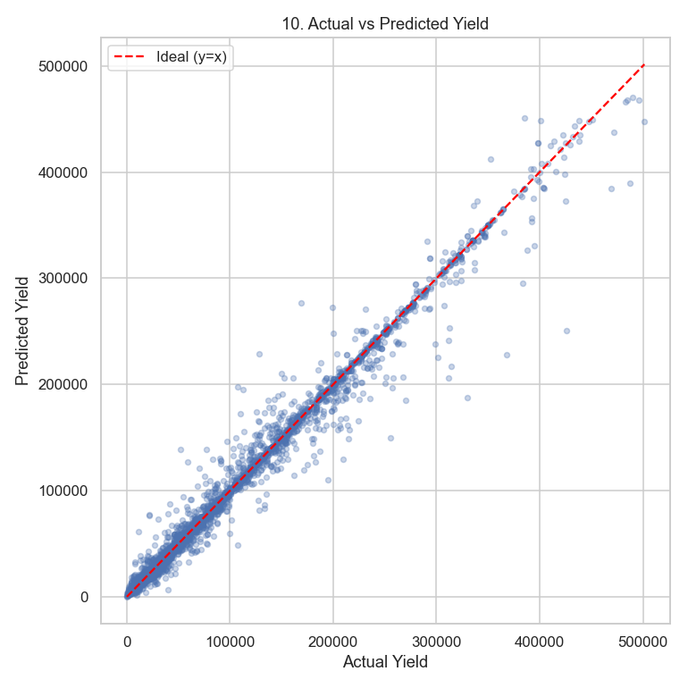

<div align="center">

# Crop Yield Prediction

### Portfolio-Level Machine Learning Pipelines on Real-World Kaggle Datasets

[](https://www.python.org/)
[](https://scikit-learn.org/)
[](https://xgboost.readthedocs.io/)
[](https://lightgbm.readthedocs.io/)
[](https://catboost.ai/)
[](https://jupyter.org/)
[](#license)

**Flagship project:** predicting agricultural crop yield (`hg/ha_yield`) from crop type, region, year, rainfall, temperature, and pesticide usage — a full regression pipeline from raw CSV to a tuned, interpreted, error-audited model.

End-to-end EDA → Preprocessing → Feature Engineering → Feature Importance → Modeling → Cross-Validation → Hyperparameter Tuning → Model Comparison → Error Analysis.



</div>

---

## Table of Contents

- [Overview](#overview)
- [Crop Yield Prediction — Flagship Project](#crop-yield-prediction--flagship-project)
- [Portfolio Datasets](#portfolio-datasets)
- [Methodology](#methodology)
- [Repository Structure](#repository-structure)
- [Results](#results)
- [Key Insights](#key-insights)
- [Tech Stack](#tech-stack)
- [Getting Started](#getting-started)
- [Reports & Presentation](#reports--presentation)
- [License](#license)

---

## Overview

This repository is a portfolio of complete, independent classical machine learning pipelines — one per dataset — each covering the full workflow from raw data to a production-style recommendation:

1. **Exploratory Data Analysis** — shape, missing values, duplicates, target distribution, outliers, correlations, bivariate relationships
2. **Data Cleaning** — justified handling of missing/duplicate data
3. **Feature Engineering** — hand-crafted features grounded in domain reasoning
4. **Categorical Encoding** — one-hot / ordinal encoding with a stated rationale
5. **Feature Importance** — Random Forest–based ranking with interpretation
6. **Model Training** — multiple algorithms per problem, evaluated with problem-appropriate metrics
7. **Cross-Validation & Hyperparameter Tuning** — `RandomizedSearchCV`, and for the time-indexed dataset, `TimeSeriesSplit` vs. `K-Fold`
8. **Error Analysis** — where and why the best model fails, not just its headline score
9. **Final Comparison & Business Recommendation** — best model, trade-offs, and a plain-language answer to the original question

Every notebook is fully executed and reproducible — all outputs, tables, and charts you see were generated by re-running the code, not hand-written.

## Crop Yield Prediction — Flagship Project

**Question:** *given a crop's type, region, year, rainfall, temperature, and pesticide usage, how accurately can we predict its yield — and what drives that yield the most?*

| | |
|---|---|
| **Dataset** | [`patelris/crop-yield-prediction-dataset`](https://www.kaggle.com/datasets/patelris/crop-yield-prediction-dataset) (Kaggle) |
| **Rows** | 28,242 raw → 25,932 after de-duplication |
| **Target** | `hg/ha_yield` (hectograms per hectare) — **continuous regression** |
| **Best model** | **Random Forest** — R² = **0.9848**, MAE ≈ 3,965, RMSE ≈ 10,507 (test set) |
| **Baseline** | Mean-prediction dummy regressor — R² ≈ 0 |
| **Top drivers** | Crop type (`Item`), region (`Area`), pesticide usage, temperature, rainfall |

Unlike the other datasets in this portfolio (imbalanced binary classification), this is a **regression** problem with a strong temporal dimension (`Year`, 1990–2013), which motivated two extra experiments not present elsewhere in the repo:

- **Random vs. time-based train/test split** — random split scores R² = 0.985, but a strictly time-ordered split (train on early years, test on later years — the realistic forecasting scenario) drops to R² = 0.956, showing that random-split evaluation is optimistic for a real deployment.
- **`K-Fold` vs. `TimeSeriesSplit` cross-validation** — mean R² 0.988 vs. 0.951, confirming the same effect under cross-validation.

Full write-up, all 11 charts, and the fully executed notebook: [`Dataset-4/report.md`](Dataset-4/report.md) · [`Dataset-4/notebook.ipynb`](Dataset-4/notebook.ipynb)

## Portfolio Datasets

| # | Dataset | Task | Source (Kaggle) | Rows | Target |
|---|---|---|---|---|---|
| **4** | **Crop Yield Prediction** | Regression | [`patelris/crop-yield-prediction-dataset`](https://www.kaggle.com/datasets/patelris/crop-yield-prediction-dataset) | 25,932 | `hg/ha_yield` |
| 1 | Credit Card Customers | Classification | [`sakshigoyal7/credit-card-customers`](https://www.kaggle.com/datasets/sakshigoyal7/credit-card-customers) | 10,127 | `Attrition_Flag` |
| 2 | Adult Census Income | Classification | [`uciml/adult-census-income`](https://www.kaggle.com/datasets/uciml/adult-census-income) | 32,561 | `income` |
| 3 | Bank Customer Churn | Classification | [`shrutimechlearn/churn-modelling`](https://www.kaggle.com/datasets/shrutimechlearn/churn-modelling) | 10,000 | `Exited` |

Datasets 1–3 are **imbalanced binary classification** problems; Dataset 4 (this repo's flagship) is **regression**. Each requires a distinct set of preprocessing and feature-engineering decisions — detailed in its own `report.md`. A fifth, standalone project — [`support-ticket-ml/`](support-ticket-ml/) (support ticket priority classification, 50K rows) — lives alongside this portfolio with its own README.

## Methodology

```
EDA → Data Cleaning → Feature Engineering → Categorical Encoding → Baseline
    → Model Training → Cross-Validation → Hyperparameter Tuning
    → Feature Importance → Error Analysis → Final Comparison
```

- **Regression models (Dataset 4):** Linear Regression, Decision Tree, Random Forest, XGBoost, LightGBM, CatBoost
- **Classification models (Datasets 1–3):** XGBoost, LightGBM, CatBoost
- **Tuning:** `RandomizedSearchCV` (`n_iter=15`, `cv=3`)
- **Regression metrics:** MAE, RMSE, R²
- **Classification metrics:** Accuracy, Precision, Recall, F1-score, ROC-AUC

## Repository Structure

```
Crop-Yield-Prediction/
│
├── README.md
├── requirements.txt
├── presentation.pdf              # Slide deck summary
│
├── Dataset-4/                    # ★ Crop Yield Prediction (flagship, regression)
│   ├── notebook.ipynb             # Fully executed, reproducible
│   ├── images/                    # 11 saved charts (EDA + importance + diagnostics)
│   ├── data/                      # Raw CSV
│   └── report.md                  # Written summary of findings
│
├── Dataset-1/                    # Credit Card Customers (classification)
│   ├── notebook.ipynb
│   ├── images/
│   ├── data/
│   └── report.md
│
├── Dataset-2/                    # Adult Census Income (classification)
│   ├── notebook.ipynb
│   ├── images/
│   ├── data/
│   └── report.md
│
├── Dataset-3/                    # Bank Customer Churn (classification)
│   ├── notebook.ipynb
│   ├── images/
│   ├── data/
│   └── report.md
│
└── support-ticket-ml/            # Standalone bonus project (own README)
    ├── notebooks/
    ├── images/
    ├── data/
    └── README.md
```

## Results

**Dataset 4 — Crop Yield Prediction (regression, test set, Random Forest tuned):**

| Model | MAE | RMSE | R² |
|---|---|---|---|
| Linear Regression | 30,785.67 | 44,405.78 | 0.7279 |
| Decision Tree | 4,034.43 | 12,463.93 | 0.9786 |
| **Random Forest** | **3,965.12** | **10,507.23** | **0.9848** |
| XGBoost | 8,959.76 | 16,180.14 | 0.9639 |
| LightGBM | 11,273.27 | 19,040.16 | 0.9500 |
| CatBoost | 10,115.27 | 16,530.34 | 0.9623 |

**Datasets 1–3 — best-performing model per dataset (tuned, classification):**

| Dataset | Best Model | Accuracy | Precision | Recall | F1 | ROC-AUC |
|---|---|---|---|---|---|---|
| 1 — Credit Card Customers | **CatBoost** | 0.9719 | 0.9497 | 0.8708 | 0.9085 | **0.9931** |
| 2 — Adult Census Income | **LightGBM** | 0.8697 | 0.7830 | 0.6560 | **0.7139** | 0.9279 |
| 3 — Bank Customer Churn | **LightGBM** | **0.8690** | 0.7843 | **0.4914** | **0.6042** | **0.8661** |

<details>
<summary><strong>Full model comparison — all datasets, all models — click to expand</strong></summary>

**Dataset 4 — Crop Yield Prediction**

| Model | MAE | RMSE | R² |
|---|---|---|---|
| Linear Regression | 30,785.67 | 44,405.78 | 0.7279 |
| Decision Tree | 4,034.43 | 12,463.93 | 0.9786 |
| Random Forest | 3,965.12 | 10,507.23 | 0.9848 |
| XGBoost | 8,959.76 | 16,180.14 | 0.9639 |
| LightGBM | 11,273.27 | 19,040.16 | 0.9500 |
| CatBoost | 10,115.27 | 16,530.34 | 0.9623 |

**Dataset 1 — Credit Card Customers**

| Model | Accuracy | Precision | Recall | F1 | ROC-AUC |
|---|---|---|---|---|---|
| XGBoost | 0.9719 | 0.9497 | 0.8708 | 0.9085 | 0.9924 |
| LightGBM | 0.9704 | 0.9316 | 0.8800 | 0.9051 | 0.9923 |
| CatBoost | 0.9719 | 0.9497 | 0.8708 | 0.9085 | 0.9931 |

**Dataset 2 — Adult Census Income**

| Model | Accuracy | Precision | Recall | F1 | ROC-AUC |
|---|---|---|---|---|---|
| XGBoost | 0.8693 | 0.7822 | 0.6553 | 0.7131 | 0.9292 |
| LightGBM | 0.8697 | 0.7830 | 0.6560 | 0.7139 | 0.9279 |
| CatBoost | 0.8688 | 0.7845 | 0.6490 | 0.7104 | 0.9285 |

**Dataset 3 — Bank Customer Churn**

| Model | Accuracy | Precision | Recall | F1 | ROC-AUC |
|---|---|---|---|---|---|
| XGBoost | 0.8610 | 0.7529 | 0.4717 | 0.5801 | 0.8460 |
| LightGBM | 0.8690 | 0.7843 | 0.4914 | 0.6042 | 0.8661 |
| CatBoost | 0.8665 | 0.7713 | 0.4889 | 0.5985 | 0.8633 |

</details>

## Key Insights

- **Crop Yield Prediction:** yield is driven far more by **what** is grown and **where** (`Item`, `Area`) than by raw climate numbers in isolation — rainfall and temperature correlate weakly with yield on their own (|r| < 0.11), but rank highly in feature importance once combined with crop/region context via tree-based splits.
- **Random-split evaluation overstates real-world performance** on time-indexed data: switching from a random 80/20 split to a strict time-based split (or `K-Fold` to `TimeSeriesSplit`) drops R² from ~0.99 to ~0.95–0.96 — the gap a production forecasting system would actually face.
- Model error is not uniform: the best model's absolute error is **~5.4× higher** in the top yield quartile than the bottom quartile — high-yield, data-sparse crop/region combinations are where predictions should be trusted least.
- Across the classification datasets, all three targets are **imbalanced**, so F1 and ROC-AUC — not raw accuracy — drove model selection.
- Hand-engineered features ranked in the **top 10** feature importances in every dataset — evidence that domain-informed feature engineering pays off, whether the task is regression or classification.
- XGBoost, LightGBM, and CatBoost perform within a narrow margin of each other on the classification datasets; on the regression dataset, plain **Random Forest** outperformed all three boosting libraries at default settings — a reminder that gradient boosting isn't automatically the best default for every tabular problem.

## Tech Stack

| Category | Tools |
|---|---|
| Data manipulation | `pandas`, `numpy` |
| Visualization | `matplotlib`, `seaborn` |
| Classical ML | `scikit-learn` (Linear/Tree/Random Forest, `RandomizedSearchCV`, `TimeSeriesSplit`, metrics) |
| Gradient Boosting | `xgboost`, `lightgbm`, `catboost` |
| Environment | `jupyter` |
| Data acquisition | `kagglehub` |

## Getting Started

```bash
# 1. Clone the repository
git clone https://github.com/AbdullohRR/Crop-Yield-Prediction.git
cd Crop-Yield-Prediction

# 2. Create and activate a virtual environment (recommended)
python -m venv venv
source venv/bin/activate        # Windows: venv\Scripts\activate

# 3. Install dependencies
pip install -r requirements.txt

# 4. Open the flagship notebook
cd Dataset-4                     # or Dataset-1, Dataset-2, Dataset-3
jupyter notebook notebook.ipynb
```

Each notebook reads its dataset from a relative `data/` path and writes charts to a relative `images/` path — always run it from **inside** its own `Dataset-X/` folder.

To re-run a notebook end-to-end from the command line:

```bash
jupyter nbconvert --to notebook --execute --inplace notebook.ipynb
```

## Reports & Presentation

- **Flagship report:** [`Dataset-4/report.md`](Dataset-4/report.md) — Crop Yield Prediction
- Other per-dataset summaries: [`Dataset-1/report.md`](Dataset-1/report.md) · [`Dataset-2/report.md`](Dataset-2/report.md) · [`Dataset-3/report.md`](Dataset-3/report.md)
- Slide deck summarizing the whole project: [`presentation.pdf`](presentation.pdf)

## License

This project is licensed under the [MIT License](LICENSE).
